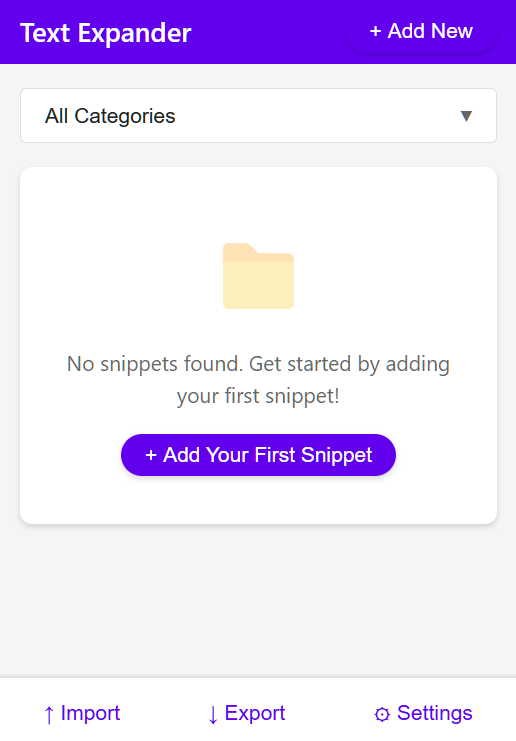

# Simple Text Expander for Chrome

A lightweight, Material Design text expander Chrome extension that follows the KISS (Keep It Simple, Stupid) principle.



## Features

- Type a shortcut followed by a trigger character (default is `:`) to expand text
- Customizable trigger character via Settings
- Dynamic variables including date, time, and clipboard content
- Cursor positioning with `%CURSOR%` variable
- Simple, Material Design interface
- Organize snippets with categories
- Backup and restore functionality for your snippets
- No cloud sync, keeping your data on your device
- Privacy-focused: all data remains local

## Installation

### Install from Source (Developer Mode)

1. Download or clone this repository
2. Open Chrome and navigate to `chrome://extensions/`
3. Enable "Developer mode" by toggling the switch in the top-right corner
4. Click "Load unpacked" and select the extension directory
5. The extension should now be installed and ready to use

### Install from Chrome Web Store

*Coming soon*

## Usage

### Creating a Snippet

1. Click the Text Expander icon in the Chrome toolbar
2. Click "Add New"
3. Enter a shortcut (e.g., "sig")
4. Enter the text you want it to expand to
5. Optionally assign a category
6. Click "Save"

### Using a Snippet

Type your shortcut followed by the trigger character (default is `:`) in any text field, and it will automatically expand.

Example:
- Type: `sig:`
- Gets replaced with: "Best regards, Your Name"

### Variables

You can use these special variables in your snippets:

| Variable | Description |
|----------|-------------|
| `%DATE%` | Current date |
| `%TIME%` | Current time |
| `%DATETIME%` | Current date and time |
| `%CLIPBOARD%` | Current clipboard content |
| `%CURSOR%` | Where cursor should be placed after expansion |

### Backup & Restore

To safeguard your snippets or transfer them to another computer:

1. Click the Text Expander icon in your Chrome toolbar
2. Click "Backup & Restore" in the bottom menu
3. In the dialog that appears:
   - **Export**: Copy the displayed JSON text and save it to a file
   - **Import**: Paste previously exported JSON data and click "Import Snippets"

You can also access this functionality from the Settings page.

### Customization

Access the settings page by clicking the gear icon in the extension popup or by right-clicking the extension icon and selecting "Options". You can:

1. Enable/disable text expansion
2. Change the trigger character (default is `:`) 

## Development

### Project Structure

```
text-expander/
├── manifest.json          # Extension configuration
├── background.js          # Background script for expansion logic
├── content.js             # Content script for text detection and replacement
├── storage.js             # Handles snippet storage
├── config-backup.js       # Manages backup and restore functionality
├── popup/                 # UI for managing snippets
│   ├── popup.html
│   ├── popup.js
│   ├── popup.css
├── options/               # Settings page
│   ├── options.html
│   ├── options.js
│   ├── options.css
├── help/                  # Help documentation
│   ├── help.html
├── icons/                 # Extension icons
    ├── icon16.png
    ├── icon48.png
    ├── icon128.png
```

### Building and Testing

Since Chrome extensions are simply a collection of files, there's no build step required. To test changes:

1. Make your modifications
2. Go to `chrome://extensions/`
3. Click the refresh icon on your extension card
4. Test your changes

## Privacy

Text Expander respects your privacy:
- All snippets are stored locally in your browser
- No data is sent to any external servers
- Your text never leaves your device
- Only requires minimal permissions to function

## Contributing

Contributions are welcome! Please feel free to submit a Pull Request.

## License

This project is licensed under the MIT License.

## Acknowledgments

- Icons by [Alfredo Hernandez - Flaticon](https://www.flaticon.com/free-icons/text)
- Inspired by the Material Design guidelines